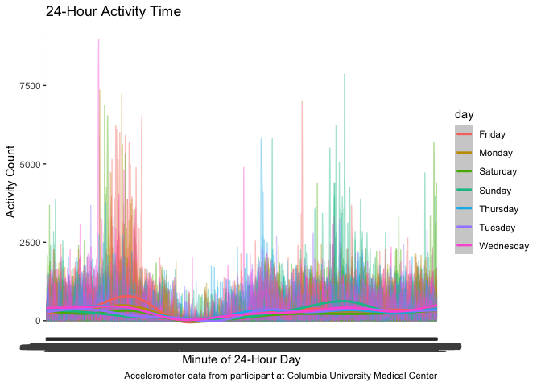
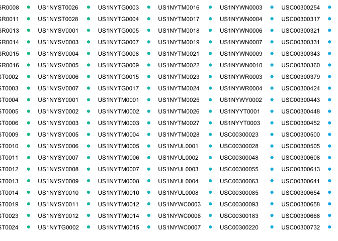
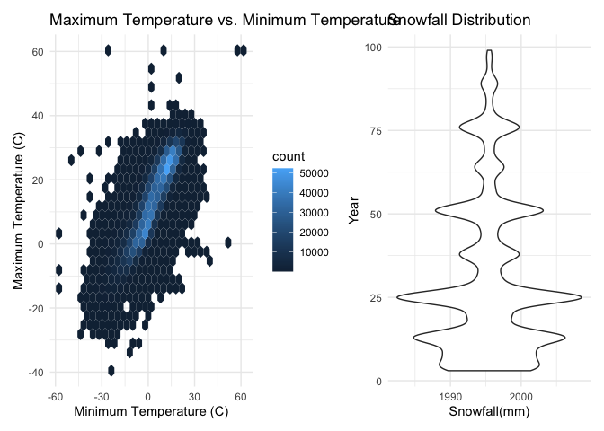

Homework 3
================
Allison Stewart

This is my solution for Homework 3.

``` r
library(tidyverse)
```

    ## ── Attaching packages ───────────────────────────────── tidyverse 1.3.0 ──

    ## ✓ ggplot2 3.3.2     ✓ purrr   0.3.4
    ## ✓ tibble  3.0.3     ✓ dplyr   1.0.2
    ## ✓ tidyr   1.1.2     ✓ stringr 1.4.0
    ## ✓ readr   1.3.1     ✓ forcats 0.5.0

    ## ── Conflicts ──────────────────────────────────── tidyverse_conflicts() ──
    ## x dplyr::filter() masks stats::filter()
    ## x dplyr::lag()    masks stats::lag()

``` r
library(readxl)
library(dplyr)
library(ggplot2)
library(patchwork)
library(ggridges)
library(hexbin)
```

## Problem 1

``` r
library(p8105.datasets)
data("instacart")
```

This dataset contains 1384617 rows and 15 columns. Observations are at
the level of items in orders by user. There are also item variables –
name, aisle, department, and some numeric codes.

How many aisles, and which are most items from?

``` r
instacart %>% 
  count(aisle) %>% 
  arrange(desc(n))
```

    ## # A tibble: 134 x 2
    ##    aisle                              n
    ##    <chr>                          <int>
    ##  1 fresh vegetables              150609
    ##  2 fresh fruits                  150473
    ##  3 packaged vegetables fruits     78493
    ##  4 yogurt                         55240
    ##  5 packaged cheese                41699
    ##  6 water seltzer sparkling water  36617
    ##  7 milk                           32644
    ##  8 chips pretzels                 31269
    ##  9 soy lactosefree                26240
    ## 10 bread                          23635
    ## # … with 124 more rows

Make a plot\!

``` r
instacart %>% 
  count(aisle) %>% 
  filter(n > 10000) %>% 
  mutate(
    aisle = factor(aisle), 
    aisle = fct_reorder(aisle,n)
  ) %>% 
  ggplot(aes(x = aisle, y = n)) + 
  geom_point() +
  theme(axis.text.x = element_text(angle = 90, vjust = 0.5, hjust = 1))
```

<!-- -->

Make a table\!

``` r
instacart %>%
  filter(aisle %in% c("baking ingredients", "dog food care", "packaged vegetable fruits")) %>% 
  group_by(aisle) %>% 
  count(product_name) %>% 
  mutate(rank = min_rank(desc(n))) %>% 
  filter(rank < 4) %>% 
  arrange(aisle, rank) %>% 
  knitr::kable()
```

| aisle              | product\_name                                 |   n | rank |
| :----------------- | :-------------------------------------------- | --: | ---: |
| baking ingredients | Light Brown Sugar                             | 499 |    1 |
| baking ingredients | Pure Baking Soda                              | 387 |    2 |
| baking ingredients | Cane Sugar                                    | 336 |    3 |
| dog food care      | Snack Sticks Chicken & Rice Recipe Dog Treats |  30 |    1 |
| dog food care      | Organix Chicken & Brown Rice Recipe           |  28 |    2 |
| dog food care      | Small Dog Biscuits                            |  26 |    3 |

Apples vs. ice cream

``` r
instacart %>% 
  filter(product_name %in% c("Pink Lady Apples", "Coffee Ice Cream")) %>% 
  group_by(product_name, order_dow) %>% 
  summarize(mean_hour = mean(order_hour_of_day)) %>% 
  pivot_wider(
    names_from = order_dow, 
    values_from = mean_hour
  )
```

    ## `summarise()` regrouping output by 'product_name' (override with `.groups` argument)

    ## # A tibble: 2 x 8
    ## # Groups:   product_name [2]
    ##   product_name       `0`   `1`   `2`   `3`   `4`   `5`   `6`
    ##   <chr>            <dbl> <dbl> <dbl> <dbl> <dbl> <dbl> <dbl>
    ## 1 Coffee Ice Cream  13.8  14.3  15.4  15.3  15.2  12.3  13.8
    ## 2 Pink Lady Apples  13.4  11.4  11.7  14.2  11.6  12.8  11.9

## Problem 2

``` r
accel_df = 
  read.csv("./accel_data.csv") %>% 
  janitor::clean_names() %>% 
  pivot_longer(
    activity_1:activity_1440, 
    names_to = "activity_minute", 
    values_to = "activity_count") %>% 
  relocate(day_id) %>% 
  mutate("weekday_weekend" = day) %>% 
  mutate(weekday_weekend = recode(weekday_weekend, Monday = "Weekday", Tuesday = "Weekday", Wednesday = "Weekday", Thursday = "Weekday", Friday = "Weekday", Saturday = "Weekend", Sunday = "Weekend")) %>% 
  mutate_at(vars(activity_minute), as.factor) %>% 
  mutate_at(vars(day), as.factor) %>% 
  mutate_at(vars(weekday_weekend), as.factor)
```

This dataset contains five weeks of accelerometer data collected on a
63-year-old male who was admitted to the Columbia University Medical
Center and diagnosed with congestive heart failure. The variables in the
dataset are day\_id, week, day, activity\_minute, activity\_count,
weekday\_weekend. The activity\_minute variable represents each minute
of a 24-hour day starting at midnight, with the respective activity
counts for each minute shown by the activity\_count variable. The final
table contains 50400 rows and 6 columns. The mean activity count over
the five-week period is 267.0440592.

Create a total activity variable for each day and create a table.

``` r
accel_df %>% 
  group_by(day_id, week, day, weekday_weekend) %>% 
  summarize(total_activity = sum(activity_count)) %>% 
  knitr::kable()
```

    ## `summarise()` regrouping output by 'day_id', 'week', 'day' (override with `.groups` argument)

| day\_id | week | day       | weekday\_weekend | total\_activity |
| ------: | ---: | :-------- | :--------------- | --------------: |
|       1 |    1 | Friday    | Weekday          |       480542.62 |
|       2 |    1 | Monday    | Weekday          |        78828.07 |
|       3 |    1 | Saturday  | Weekend          |       376254.00 |
|       4 |    1 | Sunday    | Weekend          |       631105.00 |
|       5 |    1 | Thursday  | Weekday          |       355923.64 |
|       6 |    1 | Tuesday   | Weekday          |       307094.24 |
|       7 |    1 | Wednesday | Weekday          |       340115.01 |
|       8 |    2 | Friday    | Weekday          |       568839.00 |
|       9 |    2 | Monday    | Weekday          |       295431.00 |
|      10 |    2 | Saturday  | Weekend          |       607175.00 |
|      11 |    2 | Sunday    | Weekend          |       422018.00 |
|      12 |    2 | Thursday  | Weekday          |       474048.00 |
|      13 |    2 | Tuesday   | Weekday          |       423245.00 |
|      14 |    2 | Wednesday | Weekday          |       440962.00 |
|      15 |    3 | Friday    | Weekday          |       467420.00 |
|      16 |    3 | Monday    | Weekday          |       685910.00 |
|      17 |    3 | Saturday  | Weekend          |       382928.00 |
|      18 |    3 | Sunday    | Weekend          |       467052.00 |
|      19 |    3 | Thursday  | Weekday          |       371230.00 |
|      20 |    3 | Tuesday   | Weekday          |       381507.00 |
|      21 |    3 | Wednesday | Weekday          |       468869.00 |
|      22 |    4 | Friday    | Weekday          |       154049.00 |
|      23 |    4 | Monday    | Weekday          |       409450.00 |
|      24 |    4 | Saturday  | Weekend          |         1440.00 |
|      25 |    4 | Sunday    | Weekend          |       260617.00 |
|      26 |    4 | Thursday  | Weekday          |       340291.00 |
|      27 |    4 | Tuesday   | Weekday          |       319568.00 |
|      28 |    4 | Wednesday | Weekday          |       434460.00 |
|      29 |    5 | Friday    | Weekday          |       620860.00 |
|      30 |    5 | Monday    | Weekday          |       389080.00 |
|      31 |    5 | Saturday  | Weekend          |         1440.00 |
|      32 |    5 | Sunday    | Weekend          |       138421.00 |
|      33 |    5 | Thursday  | Weekday          |       549658.00 |
|      34 |    5 | Tuesday   | Weekday          |       367824.00 |
|      35 |    5 | Wednesday | Weekday          |       445366.00 |

It is difficult to identify overall trends with this table but we can
see that the minimum total activity, a significant decrease from the
average total activity count, occurred on Saturdays. There were
fluctuations of activity throughout the week.

Make a single-panel plot.

``` r
accel_df %>% 
  mutate_at(vars(activity_minute), as.integer) %>% 
  ggplot(aes(x = activity_minute, y = activity_count, group = day_id, color = day)) +
  geom_line(alpha = .4) +
  geom_smooth(aes(group = day)) +
  scale_x_continuous(
    breaks = c(500, 1000, 1500), 
    labels = c("500", "1000", "1500")
  ) + 
  labs(
    title = "24-Hour Activity Time", 
    x = "Minute of 24-Hour Day", 
    y = "Activity Count",
    caption = "Accelerometer data from participant at Columbia University Medical Center") + 
  theme_set(theme_minimal())
```

    ## `geom_smooth()` using method = 'gam' and formula 'y ~ s(x, bs = "cs")'

<!-- -->

From this graph, we can see that the participant consistently was most
active early in the morning, around 4am, with the activity level
elevated on Friday. There is also a peak in activity on Sunday in the
evening around 8pm. The participant was least active around 8am on all
days.

## Problem 3

``` r
library(p8105.datasets)
data("ny_noaa")
```

This dataset contains 2595176 rows and 7 columns. The variables of the
dataset include: id, date, prcp, snow, snwd, tmax, tmin. There are many
missing values for the precipitation, snowfall, snow depth, and
temperature variables; some stations have missing values for all of
these variables. Maximum and minimum temperatures, in particular, are
missing from many stations.

Clean and mutate ny\_noaa dataset.

``` r
weather_df = 
  ny_noaa %>% 
  separate(date, c("year", "month", "day"), sep = "-", convert = TRUE) %>% mutate(tmin = as.numeric(tmin)) %>% 
mutate(tmax = as.numeric(tmax)) %>% 
  mutate(tmin = tmin/10) %>% 
  mutate(tmax = tmax/10)
```

The most commonly observed values for snowfall are 0 and missing.

Make a two-panel plot showing the average max temp in Jan and July.

``` r
tmax_weather = 
  weather_df %>% 
  filter(month %in% c("1", "7")) %>% 
  group_by(id, year, month) %>% 
  summarize(mean_tmax = mean(tmax, na.rm = TRUE)) 
```

    ## `summarise()` regrouping output by 'id', 'year' (override with `.groups` argument)

``` r
ggplot(tmax_weather, aes(x = year, y = mean_tmax, group = id)) + geom_point() + facet_grid(~ month) +
  labs(
    title = "Mean average temperature for January and July across stations and years",
    x = "year", 
    y = "average maximum temperature (C)") +
    theme_set(theme_minimal())
```

    ## Warning: Removed 5970 rows containing missing values (geom_point).

<!-- -->

From these plots, we can see that there is more variability in average
maximum temperature during the month of January as compared to July. The
average maximum temperature for July is about 25 degrees Celsius higher
than that of January. We can see a few outliers, including a maximum
temperature of 14 degrees Celsius in July of 1998 and a maximum
temperature of about 4 degrees Celsius in January of 1982.

Plot tmax vs tmin and snowfall distribution.

``` r
p3_plot_2 = 
weather_df %>% 
  ggplot(aes(x = tmin, y = tmax)) + 
  geom_hex() + 
 labs(
    title = "Maximum Temperature vs. Minimum Temperature", 
    x = "Minimum Temperature (C)", 
    y = "Maximum Temperature (C)")

p3_plot_3 = 
  weather_df %>% 
  filter(snow > 0 & snow < 100) %>% 
  ggplot(aes(x = year, y = snow, group = year)) +
  geom_violin() +
  labs(
    title = "Snowfall Distribution", 
    x = "Year", 
    y = "Snowfall Distribution(mm)")

(p3_plot_2 + p3_plot_3) 
```

    ## Warning: Removed 1136276 rows containing non-finite values (stat_binhex).

<!-- -->

The Maximum Temperature vs. Minimum Temperature plot shows a pattern in
which maximum temperature temperature increases as minimum temperature
increases. There are several outliers, notably a couple data points that
represent a minimum and maximum temperature of 60 degrees Celsius. The
most observations are concentrated between 0 and 30 degrees celsius.

The Snowfall Distribution plot indicates a slight increase in median
rainfall from 1980 to 1995 and then a decrease from 1995 to 2010.
